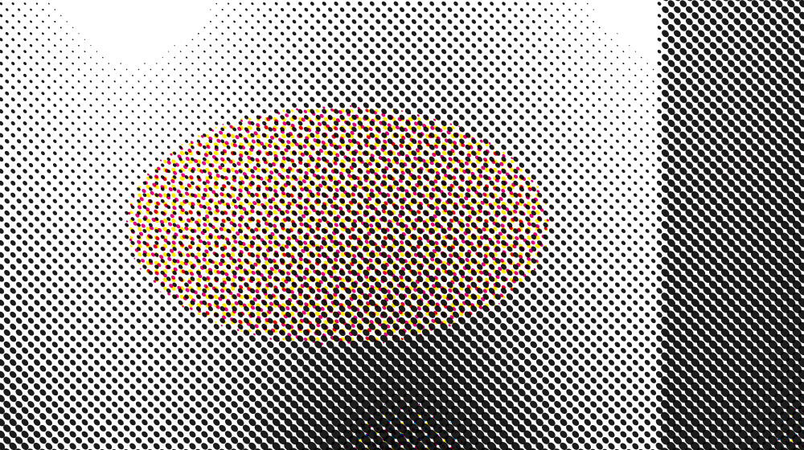
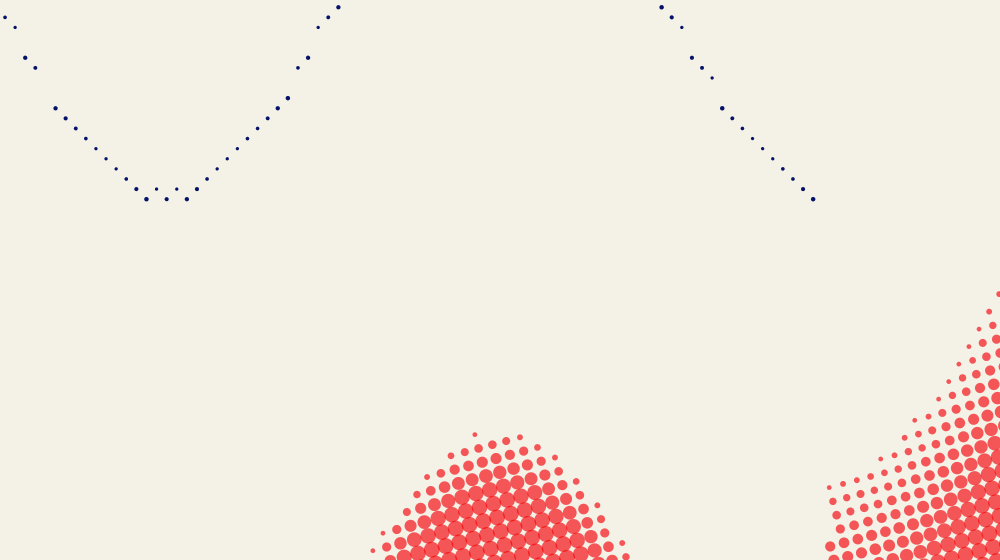
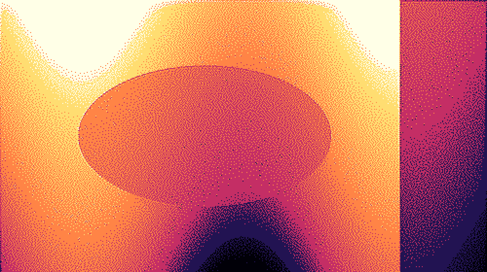

# Halftone Studio

A Photoshop UXP plugin for bitmapping artwork, with two rendering engines:

- **Halftone** — a grid of dots whose size follows local tone, either as a single
  screen or as **one independently angled screen per ink**, overprinted into a
  real CMYK-style rosette. Screens can be **AM** (classic: dot size varies) or
  **FM** (stochastic: dot size is fixed and placement varies).
- **Dither** — 24 dithering algorithms (Bayer, clustered, blue noise, and ten
  error-diffusion kernels) that pick one palette colour per pixel.

Both are computed by the plugin's own engine, not by a stack of Photoshop
adjustment layers. Both can output either a flat pixel layer or a
**colour-separated stack of editable fill layers**, can be confined to the
**active selection**, and can be run across many layers at once with **Batch
Apply**. A halftone can also be exported as **vector SVG** rather than pixels.






---

## Install

You need **Photoshop 24.0 or newer** (the imaging API the plugin reads and
writes pixels with landed in 23.3; 24.0 is the floor declared in the manifest)
and the [UXP Developer Tool](https://developer.adobe.com/photoshop/uxp/2022/guides/devtool/),
which installs from the Creative Cloud Desktop app.

1. `git clone https://github.com/YassineTns/Photoshop.git halftone-studio`
2. Open **UXP Developer Tool**, press **Add Plugin**, select `manifest.json`.
3. Press **Load**. The panel appears under **Plugins ▸ Halftone Studio**.
4. While developing, **Watch** reloads the panel whenever a file changes.

There is no build step and no dependencies. The plugin is plain CommonJS modules
loaded directly by UXP, so what you edit is what runs. `npm install` is only
needed if you want to run the tests.

### Trying it without Photoshop

Two generated pages run in any browser, built with `npm run playground`:

`panel-preview.html` is **index.html's own markup driven by the real panel.js**,
against stub host modules. Photoshop calls do nothing, so Apply is inert, but
everything up to the moment a button is pressed is the genuine panel — which is
what the layout test drives.

`playground.html` is the whole rendering engine in one self-contained file.
Double-click it — any browser, no Photoshop, no Node, no server. Drop in an
image, and every control, preset and mode behaves exactly as it does in the
panel, because it *is* the same code: the engine has no dependency on the
`photoshop` module, which is what makes both this and the Node test suite
possible.

It is the fastest way to judge the render and to try settings. What neither can
do is the Photoshop side — layers, Smart Objects, colour separation into fill
layers, batch.

`npm run shoot -- 360 dark panel.png` screenshots the real panel through
`panel-preview.html`, which is how the styling gets reviewed without a Photoshop
reload each time.

## Use

1. Select a pixel or Smart Object layer.
2. Press **Load Layer**. The panel reads the pixels and shows a live preview.
3. Pick a **Mode**, adjust anything. The preview follows every slider in real time.
4. Press **Apply**. The plugin builds:

```
Halftone ▸ HT-4f2a9c        ← group, carries the parameters
   ├── Halftone Render       ← the generated pixels (flat output)
   └── Halftone Source       ← your original, as a hidden Smart Object
```

or, with **Output: separated**:

```
Halftone ▸ HT-4f2a9c
   ├── Ink 3 #EC3E32         ← solid-colour fill layer + coverage mask
   ├── Ink 2 #161616         ← "
   ├── Ink 1 #8A7F6C         ← "
   ├── Paper #F5EBD8         ← "
   └── Halftone Source
```

5. Later, select that group and press **Load Layer**: every slider is restored
   from the stored parameters. Change what you like and press **Update** — the
   render is recomputed from the untouched source.

**Batch Apply** runs the same settings across every layer in the chosen scope
(selection, group, or whole document), skipping anything that is already halftone
output. The whole batch is a single undo step.

**Selections.** With a marquee, lasso or mask active, Apply and Update confine the
render to it (turn this off with *Output ▸ Respect selection*). The screen is
still computed across the whole layer and the selection is applied afterwards as
alpha — so a dot does not move when the selection changes, and a selected region
lines up exactly with a render of the whole layer. Feathered selections come
through as soft edges, because the coverage is used as-is rather than thresholded.

**Export SVG** writes the halftone as vector art: one `<circle>`, `<rect>` or
`<polygon>` per dot, grouped by ink, at the layer's real document size. Per-ink
screens export as one `mix-blend-mode: multiply` group per ink, so the file
overprints the same way the raster render does. Dither mode is refused rather
than exported — one shape per pixel is a file no application will open, and the
panel says so instead of writing it.

Conventions:

| Gesture | Effect |
|---|---|
| Drag a slider | Scrub |
| Shift-drag | Fine control |
| Double-click a slider, or ↺ | Restore the default |
| Click a swatch | Type a hex value |
| Alt-click a swatch | Take Photoshop's foreground colour |
| Shift-click a swatch | Lock it against re-extraction |
| Hold **Compare** | Show the untouched source |
| Alt-click a user preset | Delete it |

---

## Architecture

```
manifest.json          UXP manifest (v5)
index.html             panel markup
main.js                bootstrap (at the root: see the note in the file)
src/
  engine/              the renderers - pure JS, zero UXP dependencies
    color.js           sRGB/linear, OKLab, HSL, luma
    blur.js            3-pass box blur approximating a Gaussian
    preprocess.js      unsharp mask, edge-preserving noise reduction
    grade.js           tone LUT, Schlick bias, ink -> radius
    quantization.js    median cut, k-means, popularity
    palette.js         extraction, spread, matching, ink/paper split
    tonemap.js         shadow / midtone / highlight palette bands
    separation.js      ink unmixing (non-negative lasso) + screen angles
    shapes.js          dot shapes as signed distance functions
    resample.js        area-average downscaling
    halftone.js        grid, cell sampling, antialiased + multi-screen rasterisers
    jitter.js          deterministic press imperfection: jitter, misregistration
    dither.js          threshold matrices, diffusion kernels, dither pass
    svg.js             vector export of a screen
    pipeline.js        staged cache, mode dispatch, async chunked rendering
  photoshop/           everything that touches the host
    host.js            module access, executeAsModal, capability probing
    document.js        document + selection queries (read only)
    layers.js          layer ops (DOM first, batchPlay fallback), fill layers
    imaging.js         getPixels / putPixels / putLayerMask / getSelection
    metadata.js        parameter persistence
    render.js          Apply / Update orchestration, output modes, selection
    batch.js           multi-layer batch runner
    swatches.js        .ase and .act import / export
    files.js           writing generated files through a save dialog
  ui/
    panel.js           panel controller
    controls.js        sliders, segmented pickers, chips, toggles, palette
    styles.css
  state/params.js      the parameter schema - single source of truth
  presets/presets.js   the thirteen built-in presets
  util/                PNG encoder, UTF-8 base64
playground.html        the engine, bundled to run in a browser (generated)
panel-preview.html     the real panel, bundled the same way (generated)
test/                  engine suite + mocked-host integration suite
tools/make-icons.js
tools/build-playground.js  (crawls the requires; no hand-maintained module list)
tools/shoot.mjs            screenshot the real panel, for judging the look
```

`src/state/params.js` is the spine: the UI builds itself from it (including
which controls are visible in which mode), presets are validated against it, and
persisted records migrate through it. Adding a control means adding one entry
there.

### The two pipelines

```
                       source pixels
                             │
              area-average downscale to an "analysis" image
                             │
          denoise → blur → sharpen  (resolution-independent units)
                             │
              ┌──────────────┴───────────────┐
      HALFTONE│                              │DITHER
              │                              │
  assign every pixel to a grid       apply the tone LUT per channel
  cell, accumulate tone + colour              │
              │                        for each pixel: nearest palette
   per cell:  grade → ink → bias         entry, then either a threshold
   radius = maxRadius·√ink               matrix or error diffusion
              │                              │
  rasterise dots at output size     nearest-neighbour scale to output
```

Two decisions do most of the work.

**In halftone mode, only two operations touch pixels and neither runs at
document resolution.** Cell tone is a low-frequency measurement, so measuring it
on a downscaled image is very nearly identical — the cell sampler performs the
same area average the downscaler already did. Everything downstream operates on
the cell array. Dragging a slider never re-reads a source pixel.

**In dither mode, the grid itself is the parameter.** Dithering decides a colour
per pixel, so it cannot be reduced to cell averages. Instead it runs on a grid of
"dither pixels" whose count you set, then scales up with nearest-neighbour. That
is what gives the chunky bitmap look, what DPI-based scaling means in practice,
and it keeps the cost proportional to the grid rather than the document.

In both modes the expensive stage is cached and keyed, so **slider latency is
flat in document size** — 6 to 14 ms whether the document is 1080px or 6000px.

### Dithering

24 algorithms in three families:

| Family | Algorithms |
|---|---|
| Ordered | Bayer 2/4/8/16, Clustered 4/6/8/45°, Line H/V/45°, Blue Noise, White Noise |
| Diffusion | Floyd–Steinberg, False F–S, Jarvis, Stucki, Atkinson, Burkes, Sierra 3/2/Lite, Stevenson–Arce |
| None | Threshold |

Two details matter more than the list length.

**Ordered dithering picks the best two-colour mix, not a perturbed nearest
match.** The obvious implementation — add the threshold matrix to the pixel, then
match in OKLab — does not reproduce the right average, because the perturbation
is linear in sRGB while the decision boundary sits wherever OKLab puts it. A
black-to-white ramp came out measurably light (0.84 ink where 0.94 was wanted)
and ordered dithering disagreed with error diffusion about exposure. Instead the
engine finds the nearest entry A, the entry B whose segment towards A best
contains the pixel, and the ratio *t* along it; emitting B for a fraction *t* of
pixels makes the average exactly the best two-colour approximation. Both families
now agree on tone.

**Thresholds sit at the centre of their bin.** A matrix with L levels can only
represent tone in steps of 1/L; centring halves the worst-case error from 1/L to
1/(2L) for free. It measurably improved every ordered algorithm (Bayer 2×2:
0.188 → 0.063 worst-case ramp error; the line screens: 0.063 → 0.001).

Blue noise is generated with void-and-cluster (Ulichney) at panel start, cached
after the first build (~40 ms). Unlike Bayer it has no low-frequency energy, so
it produces no visible grid — just an even, organic sparkle.

Atkinson deliberately discards 25% of its error; that is what produces the
blown-out early-Macintosh look, and the test suite exempts it by name rather than
loosening the tolerance for everyone.

### Per-ink screens

`Screens: perInk` is the difference between a poster and a print. Each ink gets
its own grid at its own angle and the inks composite by **multiply**, because
real ink is transparent: cyan over magenta gives blue, and the offset screens
interlock into a rosette rather than beating into a moiré.

Two pieces make it work.

**Separation.** How much of each ink is needed to reach a colour, solved in
optical density space (`D = -log₁₀ reflectance`) where overprinting is addition.
With more than three inks the system is underdetermined and needs regularising,
and the choice of penalty decides the result: an **L2 (ridge)** penalty minimises
the norm by *spreading* coverage across every ink, so pure black separated as
0.59 key plus a third of everything else. An **L1** penalty promotes sparsity —
the correct prior for ink, since a press uses as few plates as it can — and makes
a pure ink resolve to itself. The solver is non-negative lasso with FISTA
momentum; plain proximal gradient was far too slow on a basis this correlated.
The sparsity weight is scaled to the basis magnitude, without which a light-ink
palette drives every coverage to zero.

The result behaves the way a separation should: pure K → 1.00 key and nothing
else, a neutral grey → key only (classic grey component replacement), blue →
cyan + magenta, skin → magenta + yellow.

**Angles.** The classic 45/15/75/0 exists because 30° apart is the maximum three
screens can be, and yellow goes at 0 because it is the least visible. The darkest
ink is screened first so the most visible pattern lands on the least visible
angle. `Angle Spread` scales the separation; at 0 every screen collapses onto one
angle, which is a deliberate graphic look rather than a print one.

### Halftone dot quality

- **Antialiasing** is analytic: each shape is a signed distance function and
  coverage is `clamp(0.5 − sdf, 0, 1)`. No supersampling, so no memory blow-up.
- **Sub-pixel dots** (radius < 0.5px) splat their exact analytic area bilinearly
  onto four pixels. Without this the highlight end of a gradient clamps to a
  fixed half-covered pixel and the ramp visibly stops being smooth.
- **Dot area is proportional to tone** (radius ∝ √ink), which is how a real
  amplitude-modulated screen behaves.
- **Shapes are area-matched** to within 4%, so switching shape changes the
  texture without changing the exposure.
- **Elliptical dots** are 1.3:1, not 2:1. Ellipses exist to soften the tone jump
  at 50% where circles all touch at once — they join along the long axis first
  and the short axis later. Pushed further, the long axes chain into unbroken
  diagonal lines through the shadows, which is exactly what 2:1 did.
- **Dot gain** models a press spreading ink a fixed width around every edge, so
  it is a radius offset, not a tonal curve. That is what makes it different from
  Grade Bias, and why it adds nothing at all to an empty highlight.
- **Edge-aware sampling** runs one mean-shift iteration over each cell, so a cell
  straddling a hard edge commits to the dominant side instead of reporting a grey
  average and hovering at half size all along the contour.
- **The paper colour is never used as a dot colour.** If it were, every cell
  lighter than the mid point would draw an invisible paper-coloured dot and half
  the tonal range would disappear.

### Colour

Quantisation and matching happen in **OKLab**, which is why palettes stay clean
instead of muddy. `kmeans` is the default: seeded by median cut (so it is
deterministic) and it respawns dead centroids, so it always returns the number of
colours you asked for. On the flat-colour fixture it recovers all five source
colours exactly, where median cut lands within ΔE 0.13.

**Tonal zones** split the palette into shadow / midtone / highlight bands and
restrict matching to the band a pixel's luminance falls in. The palette is
already sorted dark to light, so each band owns a contiguous slice of indices —
which makes this an index range, not a per-pixel subset search. Bands overlap by
one entry: without that, error diffusion cannot carry error across a boundary and
the boundary shows up as a hard contour.

`Spread` pushes palette entries away from their centroid in OKLab, expanding
lightness harder than chroma. Hue/Saturation/Brightness are applied to the
palette rather than per pixel — for these pointwise HSL operations that is
equivalent, and it keeps Hue at O(colours) in every mode. Which entry is the
paper and which are inks is decided **by index on the unadjusted palette**, so a
hue rotation can never silently re-pick a different paper, and cached screens
survive it.

Individual swatches can be **locked** (shift-click) so they survive
re-extraction — pin a brand colour and let the engine choose the rest. Palettes
import and export as **.ase** (Adobe Swatch Exchange, round-trips to Illustrator
and InDesign) and **.act** (Adobe Color Table); both encoders are written by hand
against the format specs, with no dependency.

---

## Non-destructive design, and one thing UXP cannot do

**Photoshop does not let a plugin register its own Smart Filter.** The filter
list is closed to UXP and there is no API to install a re-editable filter entry
on a Smart Object. A "double-click the filter to reopen the dialog" experience is
therefore not achievable, and this plugin does not pretend it is.

What it does instead:

- your original pixels are **never modified** — they are sealed inside a Smart
  Object that stays in the document;
- the render lives on **its own layer(s)**;
- the parameters **ride along with the layer**, so selecting an old render
  restores every slider.

### Output modes

**flat** writes one pixel layer holding the composite. Update writes back into
the same layer, so any mask, opacity or blend mode you added survives.

**separated** writes one solid-colour fill layer per palette colour, each
carrying a mask with that colour's coverage. This is the better output for print
and for editing: double-click a fill layer to change that ink everywhere at once,
and the layers resample cleanly because only the mask is raster.

The masks are **mutually exclusive and sum to full coverage**, produced by
performing ordinary alpha compositing per channel (`mask_i = mask_i(1−a) + 255a`,
`mask_j *= (1−a)`). That means the stack reproduces the flat render *exactly*
and is independent of layer order — which matters, because dots of different
colours overlap and layer order would otherwise decide the result. The test suite
asserts both properties (worst deviation from full coverage: 0; worst channel
error against the flat render: 0.8/255).

Separation needs `imaging.putLayerMask`. Where that is missing the plugin falls
back to flat output and says so, rather than building half a layer stack.

### Where the parameters are stored

UXP exposes no "custom data" bag on a layer, so there is no single blessed place.
The plugin writes the same record to three places and reads them back in order of
reliability:

| # | Where | Travels in the .psd | Notes |
|---|-------|---------------------|-------|
| 1 | Layer XMP (`metadata`/`layerXMP` via batchPlay) | yes | Genuinely attached to the layer. An Action Manager property rather than a documented UXP surface, so **every write is verified by reading it straight back**; on mismatch the plugin downgrades to (2) and says so. |
| 2 | `halftone-renders.json` in the plugin's data folder | no | Always written. Keyed by render id, so it survives reopening — but only on this machine. |
| 3 | The render id in the group name (`Halftone ▸ HT-4f2a9c`) | yes | The locator that ties a selected layer back to (1) and (2). **Do not rename the group.** |

---

## Parameters

Units are chosen so that nothing depends on document resolution.

| Section | Parameter | Range | Meaning |
|---|---|---|---|
| Mode | Mode | halftone / dither | Which engine renders |
| Scale | Scale by | relative / dpi | DPI derives the grid from the document's own resolution |
| | DPI | 5–300 | Target output density (DPI mode) |
| | Density | 8–400 | Halftone cells across the longest edge |
| | Resolution | 24–2400 | Dither pixels across the longest edge |
| | Angle | 0–90° | Screen angle (halftone) |
| Halftone | Radius | 0–200% | Max dot size as a % of the cell half-size; >100% overlaps |
| | Dot Curve | 0–1 | 0 = area tracks tone (classic), 1 = radius tracks tone |
| | Shape | circle, ellipse, square, diamond, cross, line | |
| | Dot Gain | 0–20% | Ink spread on paper, added to every dot radius |
| | Screen | AM / FM | AM varies dot size; FM keeps it fixed and varies placement |
| | Screens | single / per ink | One screen, or one angled screen per ink |
| | Spread | 0–90° | Angular separation between per-ink screens |
| | Edge Aware | on/off | Bias cell sampling towards edges, for cleaner contours |
| Press Imperfection | Offset | 0–100% | Per-dot position jitter, as a % of half a cell |
| | Size Vary | 0–100% | Per-dot size jitter, as a % of the radius |
| | Rotate | 0–180° | Per-dot rotation |
| | Misregistration | 0–100% | Whole-screen offset per ink, as a % of a cell |
| | Seed | 1–9999 | Changes the pattern; the same seed always gives the same result |
| Dither | Algorithm | 24 options | See the table above |
| | Amount | 0–1 | 0 posterises with no pattern; 1 is the full dither |
| | Serpentine | on/off | Alternate scan direction; cancels diffusion artefacts |
| Pre-process | Blur | 0–40 | px per 1000px of the longest edge |
| | Sharpen | 0–200% | Unsharp mask |
| | Sharpen R | 0.3–10 | Unsharp radius |
| | Noise Red. | 0–100 | Edge-preserving smoothing |
| Colors | Colors | 2–8 | Palette size |
| | Spread | 0–1 | Palette separation in OKLab |
| | Method | kmeans, mediancut, popularity | Quantisation algorithm |
| | Palette | hex list | Click to type, alt-click for the foreground colour |
| | Lock palette | on/off | Off re-extracts from the image on every render |
| | Background | auto or hex | Paper colour (halftone) |
| Tonal Zones | Tonal zones | on/off | Restrict each tonal band to its own palette slice |
| | Shadows / Highlights | 0.05–0.95 | Band boundaries |
| Grade | Contrast / Gamma / Black / White / Exposure | | Standard grading chain |
| | Grade Bias | −1…1 | Bends tone → dot size; endpoints stay pinned |
| | Luma | luma709, luma601, perceptual | How tone is measured |
| Adjust | Hue / Saturation / Brightness / Invert | | |
| Output | Output | flat / separated | One pixel layer, or one fill layer per colour |
| | Respect selection | on/off | Confine the render to the active selection |
| Batch | Scope | selection / group / document | Which layers Batch Apply covers |
| | Shared palette | on/off | Extract one palette and pin it across the batch |

**Presets.** Halftone: Classic B&W, Soft Print, Comic, Newspaper, RGB Pop, Retro
Poster. Dither: Mac Classic, Newsprint Dither, Handheld Green, Blue Noise, Zone
Poster. Save your own with **Save Preset**.

---

## Tests

```bash
npm test              # engine (365 assertions) + mocked host (174 assertions)
npm run test:visual   # also writes PNGs to test/out/ for eyeballing
npm run test:heavy    # adds the 6000x4000 case
npm run test:layout   # panel geometry, needs playwright (skips if absent)
```

The engine suite covers a black image, a white image, a **black→white gradient**
(radii strictly monotonic, dot *area* advancing in equal steps to within 6%, ink
present in all ten bands, the sub-pixel path exercised), flat colours, a
synthetic photograph, all five shapes, transparency, all eleven presets, screen
angles, resolution independence, cache invalidation and byte-level determinism.

For dithering it asserts **tone reproduction against a derived bound**: an
ordered matrix with L distinct thresholds can only represent tone in steps of
1/L, so the tolerance is 1/(2L), not a guessed constant. That checks each matrix
achieves the best it structurally can, instead of hiding a regression behind a
loose number. Threshold and Atkinson are exempted by name, with the reason.

`test:layout` exists because the panel shipped broken twice. First with every
control piled on its neighbour: the stylesheet used three things UXP does not
implement — flex `gap`, a fixed `height` on rows containing form controls, and a
flex basis on inputs (which assert their own intrinsic width and win). Then
unable to scroll at all, because a UXP panel does not scroll its document for
you, so every section below the fold was unreachable. Neither is visible to a
unit test.

It now drives the *real* panel at 300/360/420px in both modes and both themes,
It then shipped broken a third time, by the fix for the second: giving `#app` a
definite height made its flex children shrinkable, so every section was squeezed
and its rows clipped. Chromium hides that one — CSS gives flex items an automatic
minimum size, and UXP does not implement it — so the test runs a **second pass
with that minimum removed**, which is the closest a browser can get to being UXP.

It now drives the *real* panel at 300/360/420px in both modes and both themes,
and asserts geometry: no sibling overlap, no stacked-row collision, nothing
overflowing, nothing collapsed to zero, no control rendering zero options, no
start-up errors, and that the panel scrolls far enough to reach its own last
section. 276 assertions. It cannot prove UXP agrees with Chromium, but every rule
that broke was one Chromium would have caught, because the fix in each case was
to stop relying on a feature UXP lacks.

Its most recent catch was not a layout bug at all: `panel-preview.html` failed to
start because the bundler's hand-written module list had gone stale. The bundler
now crawls the requires instead, and the list cannot disagree with the source.

For separation it asserts the properties that matter rather than pixel values:
pure inks resolve to themselves and drag nothing else in, secondaries decompose
into their constituents, neutrals go to the key ink, coverage never leaves [0,1]
for any input, and no two screens share an angle or sit closer than 15°.

FM screening is asserted on the property that distinguishes it: ink rises with
tone through *count* rather than area, white stays empty, black fills, and the
result differs from AM at the same settings. Press imperfection is asserted as
deterministic (the same cell always jitters the same way, neighbours differ, the
seed changes it), bounded by its stated budget, and tone-preserving — a roughened
press prints the same amount of ink to within 20%. SVG export is checked for
well-formedness, for producing the same shape count at any output size, for every
dot shape, and for refusing dither mode.

The integration suite runs the Photoshop and UI layers against a mocked host. It
cannot prove the batchPlay descriptors are accepted by Photoshop — only Photoshop
can — but it does prove the plugin's own logic: layer structure and ordering, the
original never being written to, mask writes reaching every fill layer, the
documented fallback when masks are unavailable, parameters round-tripping through
XMP *and* the sidecar, batches that skip their own output / isolate a failing
layer / stop cleanly on cancel, selections confining the render to their own
alpha while the frame still covers the layer (with all three "no selection" cases
— toggle off, nothing selected, host without `getSelection` — rendering the whole
layer rather than failing), SVG export reaching a real file, and that every
parameter in the schema is reachable in some UI state while no control is built
for a hidden one.

### Measured performance

Synthetic photograph, Node 22 (Photoshop will differ, but the ratios hold):

| Mode | Document | First preview | Slider re-render | Full render |
|---|---|---|---|---|
| Halftone | 1080×1080 | 41 ms | 14 ms | 32 ms |
| Halftone | 1920×1080 | 32 ms | 9 ms | 49 ms |
| Halftone | 3000×3000 | 86 ms | 14 ms | 192 ms |
| Halftone | 6000×4000 | 149 ms | 10 ms | 973 ms |
| Dither | 1080×1080 | 49 ms | 5 ms | 14 ms |
| Dither | 1920×1080 | 36 ms | 3 ms | 25 ms |
| Dither | 3000×3000 | 99 ms | 7 ms | 119 ms |
| Dither | 6000×4000 | 245 ms | 8 ms | 1065 ms |
| Per-ink (4 screens) | 6000×4000 | 679 ms | 36–102 ms | 3076 ms |

Slider latency is flat in document size. Full renders are chunked with yields so
Photoshop's UI keeps breathing, and reads from Photoshop are capped at 2600px on
the longest edge while the render is still written at full resolution.

---

## Known limitations

1. **Not a real Smart Filter.** Explained above. Update is a button.
2. **Batch covers layers, not video frames.** Rendering a video timeline
   frame-by-frame would mean rasterising the video layer per frame, which UXP
   does not expose. Frame-animation documents are covered, because their frames
   are made of ordinary layers.
3. **Per-ink screens are slower.** Four screens mean four rasterisations, so
   slider latency is 36–102 ms rather than the ~14 ms of a single screen, and a
   24-megapixel render takes about 3 s. The panel's adaptive debounce handles it.
4. **Layer XMP is not a documented UXP API.** Every write is verified by
   readback, with a sidecar fallback, so the worst case is that parameters do not
   travel to another machine inside the .psd.
5. **RGB documents only.** CMYK, Lab, Indexed and Duotone are not converted.
6. **Dither previews above 700 dither-pixels are approximate.** The preview
   caps the grid so dragging stays responsive, and the badge says `approx` when
   it does. Apply and Update always render the full grid. Halftone previews are
   always exact.
7. **Colour management is assumed sRGB.** The separation also assumes ink
   behaves as a simple subtractive filter; it has no press profile, so it models
   overprinting rather than predicting it.
8. **The plugin does not watch the Smart Object.** Edit its contents, then press
   Update.
9. **Renaming the halftone group** breaks the sidecar lookup. The layer XMP still
   works if it took.
10. **SVG export covers halftone mode only**, and is refused for dither with an
    explanation. It also has no notion of a selection: the vector file is the
    whole screen. Very fine grids produce very large files — above roughly
    200,000 shapes the panel warns that illustration apps will struggle.
11. **`imaging.getSelection` is probed, not assumed.** On a build without it the
    selection is silently ignored and the whole layer renders.

## Roadmap

1. **Press profile for the separation.** The unmixer models ink as an ideal
   subtractive filter. Loading a measured dot-gain curve and ink densities would
   turn it from a plausible model into a predictive one.
2. **Second-order rosette control**: moiré detection across screen pairs, and
   irrational screen angles as an alternative to the fixed set. (Stochastic
   screening now ships as the FM screen type.)
3. **Video timeline rendering**, if a route to rasterising a video layer per
   frame becomes available through UXP.
4. **A C++ or WASM rasteriser.** Only the rasteriser is worth moving — the
   analysis stage is already negligible. The staged interface
   (`_ensureCells` / `_ensureDither` / `_ensureScreens` → rasterise) is where a
   native module slots in without touching anything else. Per-ink mode is the
   case that would benefit most.
5. **Per-swatch tonal ranges**, so an ink can be restricted to a tonal band
   directly rather than through the shared zone splits.
