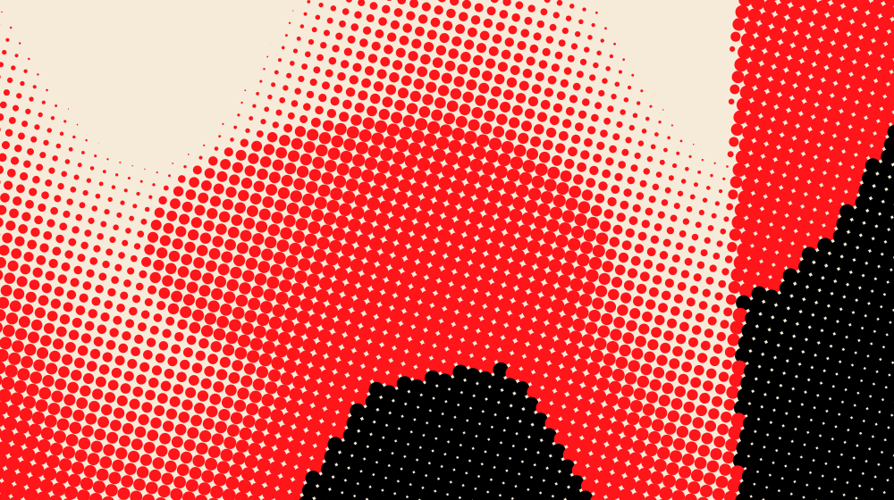

# Halftone Studio

A Photoshop UXP plugin that turns a layer into a coloured halftone: a regular
grid of dots whose size follows local luminance and whose colour comes from a
quantised palette. The rendering is done by the plugin's own engine, not by a
stack of Photoshop adjustment layers.



---

## Install

You need **Photoshop 24.0 or newer** (the imaging API the plugin reads and
writes pixels with landed in 23.3; 24.0 is the floor declared in the manifest)
and the [UXP Developer Tool](https://developer.adobe.com/photoshop/uxp/2022/guides/devtool/).

1. Clone this repository.
2. Open **UXP Developer Tool** and press **Add Plugin**.
3. Select `manifest.json` at the root of the clone.
4. Press **Load**. The panel appears under **Plugins ▸ Halftone Studio** in
   Photoshop.
5. While developing, **Watch** reloads the panel whenever a file changes.

There is no build step. The plugin is plain CommonJS modules loaded directly by
UXP, so what you edit is what runs.

To regenerate the panel icons after changing `tools/make-icons.js`:

```bash
npm run icons
```

## Use

1. Select a pixel or Smart Object layer.
2. Press **Load Layer**. The panel reads the pixels and shows a live preview.
3. Adjust anything. The preview follows every slider in real time.
4. Press **Apply**. The plugin builds this structure:

```
Halftone ▸ HT-4f2a9c        ← group, carries the parameters
   ├── Halftone Render       ← the generated pixels
   └── Halftone Source       ← your original, as a hidden Smart Object
```

5. Later, select that group again and press **Load Layer**: every slider is
   restored from the stored parameters. Change what you like and press
   **Update** — the render is recomputed from the untouched source and written
   back into the same layer, so any mask, opacity or blend mode you added to the
   render survives.

Slider conventions: drag to scrub, hold **Shift** for fine control, **double
click** (or the ↺ button) to restore the default, and type in the numeric field
for an exact value.

---

## Architecture

```
manifest.json          UXP manifest (v5)
index.html             panel markup
src/
  main.js              bootstrap
  engine/              the renderer - pure JS, zero UXP dependencies
    color.js           sRGB/linear, OKLab, HSL, luma
    blur.js            3-pass box blur approximating a Gaussian
    grade.js           tone LUT, Schlick bias, ink -> radius
    quantization.js    median cut, k-means, popularity
    palette.js         extraction, spread, matching, ink/paper split
    shapes.js          dot shapes as signed distance functions
    resample.js        area-average downscaling
    halftone.js        grid, cell sampling, antialiased rasteriser
    pipeline.js        staged cache + async chunked rendering
  photoshop/           everything that touches the host
    host.js            module access, executeAsModal, capability probing
    document.js        document + selection queries (read only)
    layers.js          layer operations (DOM first, batchPlay fallback)
    imaging.js         getPixels / putPixels
    metadata.js        parameter persistence
    render.js          Apply / Update orchestration
  ui/
    panel.js           panel controller
    controls.js        sliders, segmented pickers, toggles, palette editor
    styles.css
  state/params.js      the parameter schema - single source of truth
  presets/presets.js   the six built-in presets
  util/                PNG encoder, UTF-8 base64
test/                  engine suite + mocked-host integration suite
tools/make-icons.js
```

`src/state/params.js` is the spine: the UI builds itself from it, presets are
validated against it, and persisted records migrate through it. Adding a control
means adding one entry there.

### The rendering pipeline

```
source pixels
   ↓  area-average downscale to an "analysis" image (~500-3000px)
   ↓  optional blur
   ↓  one pass: assign every pixel to a grid cell, accumulate mean tone + colour
cells (a few thousand entries)
   ↓  tone LUT: levels → gamma → contrast → exposure
   ↓  ink = invert ? tone : 1 - tone,  then Schlick bias
   ↓  radius = maxRadius · √ink            (dot *area* tracks tone)
   ↓  colour = nearest ink-palette entry to the cell's mean colour, in OKLab
rasterise at the output resolution
```

Two decisions do most of the work here.

**Only two operations touch pixels, and neither runs at document resolution.**
Cell tone is a low frequency measurement, so measuring it on a downscaled image
is very nearly identical to measuring it on the original — the cell sampler is
performing the same area average the downscaler already did. Everything
downstream (grading, bias, palette, spread, hue, saturation, radius, shape)
operates on the cell array. Dragging a slider therefore never re-reads a source
pixel, which is why a 6000×4000 document re-renders its preview in the same ~10ms
as a 1080×1080 one.

**Density is "cells across the longest edge", not a pixel size.** Every
parameter is resolution independent, so the preview and the full render are
produced from *the same cells*, just rasterised at different sizes. They cannot
drift apart, and the test suite asserts it (`ink density matches across
resolutions`, `cell centres scale exactly`).

Because of the staging, changing Hue or Contrast reuses the measured cells
outright — asserted in the `Cache invalidation` group.

### Dot quality

- **Antialiasing** is analytic: each shape is a signed distance function and
  coverage is `clamp(0.5 − sdf, 0, 1)`, a 1px band straddling the true edge. No
  supersampling, so no memory blow-up on large documents.
- **Sub-pixel dots** (radius < 0.5px) abandon the SDF and splat their exact
  analytic area bilinearly onto the four neighbouring pixels. Without this the
  highlight end of a gradient clamps to a fixed half-covered pixel and the ramp
  visibly stops being smooth.
- **Dot area is proportional to tone** (radius ∝ √ink), which is how a real
  amplitude-modulated screen behaves and what keeps a black→white ramp even
  instead of bunching in the shadows. The `Dot Curve` slider blends towards
  radius-proportional if you want a harder look.
- **Shapes are area-matched**: a square, diamond or cross of a given "radius"
  covers the same area as the circle would, so switching shape changes the
  texture without changing the exposure. Verified to within 4%.
- **The paper colour is never used as a dot colour.** If it were, every cell
  lighter than the mid point would draw an invisible paper-coloured dot and half
  the tonal range would disappear. Tone is carried purely by dot size.

### Colour

Quantisation and colour matching happen in **OKLab**, which is why palettes stay
clean instead of muddy. `kmeans` is the default: it is seeded by median cut
(so it is deterministic — no random-initialisation lottery) and respawns dead
centroids on the worst-represented sample, so it always returns the number of
colours you asked for. On the flat-colour fixture it recovers all five source
colours exactly, where median cut lands within ΔE 0.13.

`Spread` pushes palette entries away from their centroid in OKLab, expanding
lightness harder than chroma — the punchy separation of a screen print without
tipping colours out of gamut.

Hue/Saturation/Brightness are applied to the palette and to cell colours rather
than per pixel. For these HSL operations that is exact (they are pointwise) and
reduces the cost from O(width·height) to O(colours). Hue rotation deliberately
preserves HSL lightness, so it never disturbs the dot geometry.

---

## Non-destructive design, and one thing UXP cannot do

**Photoshop does not let a plugin register its own Smart Filter.** The filter
list is closed to UXP and there is no API to install a re-editable filter entry
on a Smart Object. A genuine "double-click the filter to reopen the dialog"
experience is therefore not achievable, and this plugin does not pretend it is.

What it does instead:

- your original pixels are **never modified** — they are sealed inside a Smart
  Object that stays in the document;
- the render lives on **its own layer**, so masks, opacity and blend modes you
  add to it survive an Update;
- the parameters **ride along with the layer**, so selecting an old render
  restores every slider.

That is re-editable in every practical sense. It just is not a Smart Filter.

### Where the parameters are stored

UXP exposes no "custom data" bag on a layer, so there is no single blessed
place. The plugin writes the same record to three places and reads them back in
order of reliability:

| # | Where | Travels in the .psd | Notes |
|---|-------|---------------------|-------|
| 1 | Layer XMP (`metadata`/`layerXMP` via batchPlay) | yes | Genuinely attached to the layer. This is an Action Manager property rather than a documented UXP surface, so **every write is verified by reading it straight back**; if the readback does not match, the plugin downgrades to (2) and tells you so in the status line. |
| 2 | `halftone-renders.json` in the plugin's data folder | no | Always written. Keyed by render id, so it survives reopening — but only on this machine. |
| 3 | The render id in the group name (`Halftone ▸ HT-4f2a9c`) | yes | The locator that ties a selected layer back to (1) and (2). **Do not rename the group** — though a render whose XMP survived can still be recovered from the layer itself. |

After every Apply/Update the panel states plainly which of these took.

---

## Parameters

Units are chosen so that nothing depends on document resolution.

| Parameter | Range | Meaning |
|---|---|---|
| Density | 8–400 | Cells across the longest edge |
| Radius | 0–200% | Max dot size as a % of the cell half-size; >100% overlaps |
| Dot Curve | 0–1 | 0 = area tracks tone (classic), 1 = radius tracks tone (harder) |
| Angle | 0–90° | Screen angle |
| Blur | 0–40 | Pre-blur, in px per 1000px of the longest edge |
| Shape | circle, square, diamond, cross, line | |
| Colors | 2–8 | Palette size |
| Spread | 0–1 | Palette separation in OKLab |
| Method | kmeans, mediancut, popularity | Quantisation algorithm |
| Palette | hex list | Click a swatch to type, alt-click for the foreground colour |
| Lock palette | on/off | Off re-extracts from the image on every render |
| Background | auto or hex | auto = lightest palette colour (darkest when inverted) |
| Contrast | 0–3 | Multiplier around mid grey |
| Gamma | 0.1–3 | |
| Black / White | 0–255 | Input levels |
| Exposure | ±100% | Additive lift |
| Grade Bias | −1…1 | Bends tone → dot size; pure black and white stay pinned |
| Luma | luma709, luma601, perceptual | How tone is measured |
| Hue | ±180° | |
| Saturation | 0–3 | |
| Brightness | ±100 | |
| Invert | on/off | Dots grow in highlights; paper flips to the dark end |

Presets: **Classic B&W**, **Soft Print**, **Comic**, **Newspaper**, **RGB Pop**,
**Retro Poster**. Save your own with **Save Preset**; they persist in the plugin
data folder and appear as chips alongside the built-ins.

---

## Tests

The engine has no UXP dependency, so it runs in plain Node:

```bash
npm test              # engine (130 assertions) + mocked host (94 assertions)
npm run test:visual   # also writes PNGs to test/out/ for eyeballing
npm run test:heavy    # adds the 6000x4000 case
```

The engine suite covers the cases that matter for a halftone: a black image
(every cell at max radius), a white image (no ink at all), a **black→white
gradient** (radii strictly monotonic, dot *area* advancing in equal steps to
within 6%, ink present in all ten bands, the sub-pixel path exercised), flat
colours (every source colour recovered by quantisation), a synthetic photograph,
all five shapes, transparency, all six presets, screen angles, resolution
independence, cache invalidation and byte-level determinism.

The integration suite runs the Photoshop and UI layers against a mocked host. It
cannot prove the batchPlay descriptors are accepted by Photoshop — only
Photoshop can — but it does prove the plugin's own logic: that the layer
structure is built in the right order, that the original is never written to,
that pixels of the right size reach `putPixels`, that parameters round-trip
through XMP *and* through the sidecar fallback, and that every parameter in the
schema gets a working control.

### Measured performance

Synthetic photograph, Comic preset, Node 22 (Photoshop will differ, but the
ratios hold):

| Document | First preview | Slider re-render | Full-resolution render |
|---|---|---|---|
| 1080×1080 | 77 ms | 14 ms | 29 ms |
| 1920×1080 | 34 ms | 7 ms | 69 ms |
| 3000×3000 | 90 ms | 13 ms | 391 ms |
| 6000×4000 | 149 ms | 9 ms | 1003 ms |

Slider latency is flat in document size, which is the whole point of the staged
cache. Full renders are chunked with yields between bands so Photoshop's UI keeps
breathing, and reads from Photoshop are capped at 2600px on the longest edge —
the render is still written at full resolution.

---

## Known limitations

1. **Not a real Smart Filter.** Explained above. Update is a button, not a
   double-click on a filter entry.
2. **Layer XMP is not a documented UXP API.** It is an Action Manager property.
   The plugin verifies every write by reading it back and falls back to the
   sidecar file when it fails, so the worst case is that parameters do not travel
   to another machine inside the .psd.
3. **RGB documents only.** The engine works in sRGB. CMYK, Lab, Indexed and
   Duotone documents are not converted; convert to RGB first.
4. **The render is flattened pixels.** It is written into a normal pixel layer,
   so it does not scale losslessly the way a vector or Smart Object would.
   Re-run Update after resizing the document.
5. **No dot-level randomisation.** The grid is strictly regular by design (that
   is the look being targeted). There is no jitter or error-diffusion mode.
6. **Colour management is assumed sRGB.** Pixels are requested and written with
   an sRGB profile; documents in a wide-gamut working space will be rendered
   through that assumption.
7. **The plugin does not watch the Smart Object.** If you edit the source's
   contents, press Update — the render does not refresh on its own.
8. **Renaming the halftone group** breaks the sidecar lookup (record 3 above).
   The layer XMP still works if it took.

## Roadmap

Ordered by how much each would improve fidelity to a professional halftone:

1. **Per-channel screens with independent angles.** Real CMYK halftones give
   each ink its own angle (15°/75°/0°/45°) to produce a rosette instead of a
   moiré. The renderer is already generic over grids; this means running it once
   per ink and compositing multiply. Biggest single win.
2. **Dot gain / spot function shaping.** A configurable transfer curve on the
   ink amount, plus elliptical dots that merge along one axis first — the
   classic way midtones avoid a hard 50% checkerboard tone jump.
3. **Edge-aware cell sampling.** Weight the cell average towards the dominant
   region so dots stop straddling hard edges, which is the main source of the
   slightly ragged contours at low density.
4. **Optional supersampled rasterisation** (2×, downsampled) for the final
   render only, for people who want maximum edge quality over speed.
5. **A C++ (or WASM) rasteriser.** Only the rasteriser is worth moving — the
   analysis stage is already negligible. The current JS path holds ~1s for
   6000×4000, so this is an optimisation, not a necessity; the engine's staged
   interface (`_ensureCells` → `rasterize`) is where a native module would slot
   in without touching anything else.
6. **Live re-render on Smart Object edit,** by listening for the relevant
   Photoshop notifications instead of requiring a manual Update.
7. **Palette import/export** (.ase / .act) and per-swatch locking so extraction
   can refresh some colours while preserving others.
